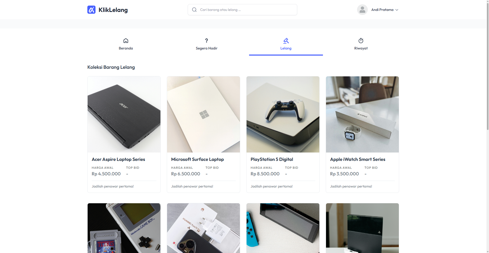

<div align="center">
<a href="https://github.com/fahmirizalbudi/kliklelang" target="blank">

</a>

<br />
<br />


</div>

<br />

## 📣 KlikLelang

KlikLelang is a simple web and mobile based online auction and bidding platform. Built with Laravel as the web application and Flutter for a mobile application. Key features include:

## 🖼️ Preview



## ✨ Features

- **📊 Dashboard:** User-friendly dashboard to manage auctions and users.
- **🔐 Authentication:** Secure login and registration system using Laravel Auth and Sanctum.
- **🔨 Bidding System:** Real-time bidding on listed items.
- **📦 Item Management:** Create, read, update, and delete auction items easily.
- **⌛ Auctiom History:** View history of bids and winning auctions.

## 👩‍💻 Tech Stack

- **Laravel**: Framework used for Backend REST API and Web Admin Panel.
- **Flutter**: Used for building the Mobile Application (Android/iOS).
- **MySQL**: Relational database management system.
- **Laravel Sanctum**: For Application Programming Interface (API) authentication.

## 📦 Getting Started

To get a local copy of this project up and running, follow these steps.

### 🚀 Prerequisites

- **PHP** (v8.2 or higher) & **Composer**.
- **Dart** (v.3.8.1 or higher) & **Flutter SDK**.
- **MySQL** (or another supported SQL database).

## 🛠️ Installation

1. **Clone the repository:**

   ```bash
   git clone https://github.com/fahmirizalbudi/kliklelang.git
   cd kliklelang
   ```

2. **Install dependencies:**

   ```bash
   #mobile
   cd mobile
   flutter pub get

   #server
   cd server
   composer install
   cp .env .env.example
   php artisan key:generate
   ```

3. **Run migration:**

   ```bash
   php artisan migrate
   ```

4. **Start the development server:**

   ```bash
   #mobile
   flutter run

   #server
   php artisan serve
   ```

## 📖 Usage

### ✔ Running the Application

- **Website development:** `php artisan serve`.
- **Mobile development:** `flutter run`.

> Open [http://localhost:8000](http://localhost:8000) to view it in the browser.

## 📜 License

All rights reserved. This project is for educational purposes only and cannot be used or distributed without permission.
